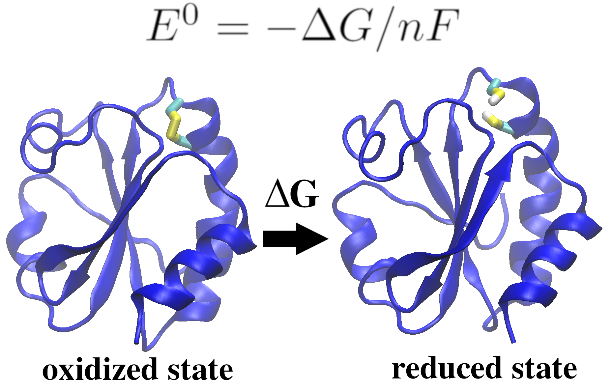

# Redox potential of a protein disulfide bond

Predicting the redox potential of a protein disulfide bond is very useful in various fields, from redox biochemistry to protein allostery to covalent ligand binding to cysteines. We explain in great detail, how you can run molecular dynamics simulations in GROMACS such that you obtain the disulfide bond redox potential of interest.

Please find all input files for redox potential calculations using fast growth thermodynamic intergration in GROMACS in this repository.

Very convincing results have been obtained for different thioredoxin like proteins, as shown in this publication:

W. Li, I. B. Baldus, F. Gräter (2015). Redox potentials of protein disulfide bonds from free-energy calculations. *J. Phys. Chem. B.* 119(17):5386-5391 [doi:10.1021/acs.jpcb.5b01051](https://doi.org/10.1021/acs.jpcb.5b01051) [PubMed](https://www.ncbi.nlm.nih.gov/pubmed/25856548)
